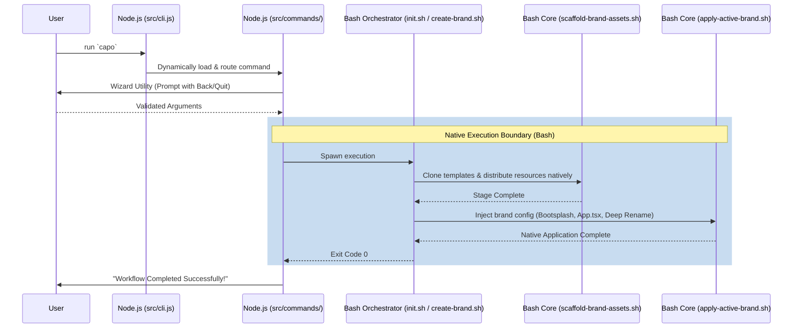
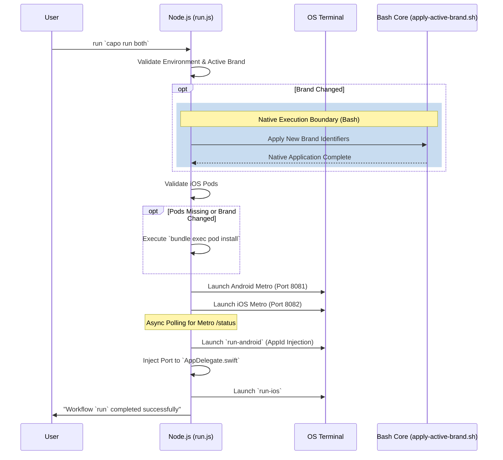

# Core Workflows

The following diagrams map the internal execution boundaries of the Capo CLI workflows, demonstrating the new decoupled Dual Architecture.

## Initial Project Scaffold (`init`) & Brand Creation (`create-brand`)

The Node.js Command Loader handles routing and interacts securely with the underlying unified Bash Executor core modules.

## Run Orchestrator (`run`)

The `run` command operates at the boundary of JS and Bash. The JS Orchestrator actively manages async states, terminal spawning, and dependency validation before dispatching parallel builds.

