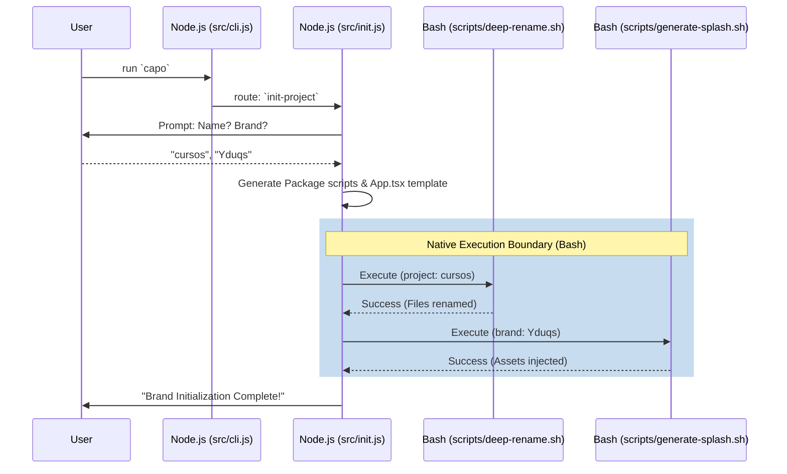

# Core Workflows

The following diagrams map the internal execution boundaries of the Capo CLI workflows.

## Initial Project Scaffold (`init-project`)

This flow completely bootstraps a brand-agnostic React Native project and binds it to its initial brand target.

